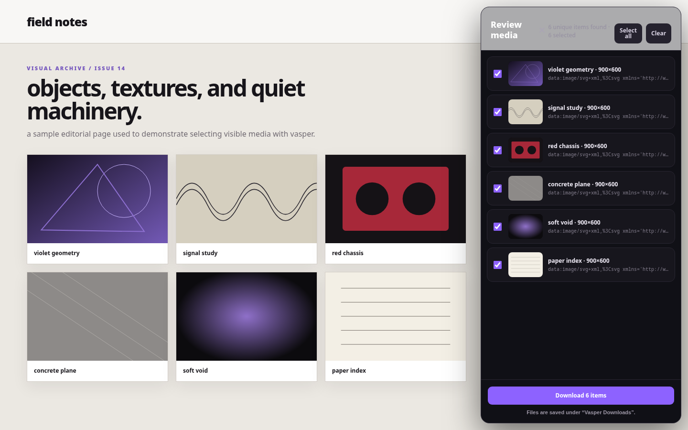

# vasper

privacy-conscious media selection and bulk downloading for chrome and chromium.

vasper is a manifest v3 browser extension that lets you drag a rectangle over a webpage, review the media found inside it, and download only the files you choose. it works with visible images, animated gifs, video, audio, svg images, canvases, direct media links, and css background images.

## screenshots

### review detected media before downloading



### start an area selection from the toolbar


## features

- drag to select any visible rectangular area on a webpage
- detect images, animated gifs, video, audio, image inputs, svg images, canvases, direct media links, and css background images
- review every result in a side panel before downloading
- select all, clear all, or toggle individual files
- deduplicate repeated media urls
- save downloads under `downloads/vasper downloads/` with stable numbered filenames
- use narrow `activetab` access instead of persistent access to browsing history or every site
- run without a build step or third-party runtime dependencies

## install from source

until a web store release is available, install vasper directly from this repository.

### download the source

choose either method:

- without git: open the [repository](https://github.com/numbpill3d/vasper), select **code → download zip**, and extract the archive
- with git:

  ```bash
  git clone https://github.com/numbpill3d/vasper.git
  ```

### load vasper in chrome or chromium

1. open `chrome://extensions`
2. enable **developer mode**
3. select **load unpacked**
4. choose the extracted `vasper` folder containing `manifest.json`
5. optionally pin vasper from the browser extensions menu

chrome or chromium may show a developer-mode notice because the extension was installed outside the web store. the extension remains installed between browser restarts.

### update a manual installation

1. download and extract the latest source again, or run `git pull` inside the cloned repository
2. return to `chrome://extensions`
3. select **reload** on the vasper extension card

## use

1. open a normal `http://` or `https://` webpage
2. select the vasper toolbar icon, then select **select an area**
3. drag a box over the media you want; a small click also selects media under the pointer
4. review the detected items, clear anything you do not want, and select **download**
5. press `esc` to cancel the selector or close the review panel

if the browser setting **ask where to save each file before downloading** is enabled, the browser may prompt for each file. disable that setting for unattended bulk downloads.

## privacy and permissions

vasper processes page media locally in the browser. it does not include analytics, remote services, accounts, or persistent access to every webpage.

- `activetab`: inspect only the tab where you explicitly start vasper
- `scripting`: inject the temporary area selector and review panel
- `downloads`: send selected files to the browser download manager

## known browser limitations

- extensions cannot run on internal browser pages, the web store, and some built-in pdf viewers
- cross-origin iframe contents are not scanned from the top-level page
- drm streams, segmented hls or dash playback, mediasource streams, expired signed urls, and server-protected files may not be directly downloadable
- blob urls are downloaded from the page context when possible, but sites may revoke them before the download starts
- cross-origin canvases cannot be exported because of browser security rules
- css images in pseudo-elements such as `::before` and `::after` are not currently included

## development

```bash
npm test
npm run check
```

core utility behavior is covered by the built-in node test runner. the unpacked extension has also been smoke-tested in chromium.

## project layout

```text
manifest.json            manifest v3 configuration
src/popup.*              toolbar popup
src/content-script.js    area selection, media discovery, and review panel
src/content.css          injected selector and review ui
src/background.js        browser downloads api integration
src/media-utils.js       shared, tested utility functions
icons/                   extension icons
screenshots/             readme screenshots
test/                    node tests
```
